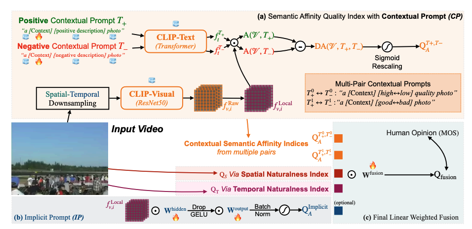

# BVQI (Zero-shot Blind Video Quality Index)


The Official Repository for BVQI, a robust zero-shot Video Quality Index, and its fine-tuned version. Accepted by ICME2023, extended to TIP (under review).


## Key Features

- Robustly predict quality without training from any MOS scores.
- Localized semantic quality prediction.
- Given a small set of MOS-labelled videos, can robustly+efficiently fine-tune on it.


May 2023 Updates (in correspondance to TIP-submitted extension):
- Visualization for SAQI-Local local quality map.
- Efficient Fine-tuning.
- Optimization on TPQI (the temporal naturalness index) to improve its speed.



Last Version (in correspondance to ICME conference version):
- Extract the three quality indexes with Pytorch.
- Combine and Evaluate.


## Paper Links

ICME2023: [Arxiv](https://arxiv.org/abs/2302.13269)

Extension (*under review for TIP*): [Arxiv](https://arxiv.org/abs/2304.14672)


## Installation

### Install OpenCLIP

To make local semantic affinity index available, the OpenCLIP should be installed as follows (or equivalently):

```
git clone https://github.com/mlfoundations/open_clip.git
cd open_clip
sed -i '92s/return x\[0\]/return x/' src/open_clip/modified_resnet.py 
pip install -e .
```

### Install BVQI

Then you need to install the BVQI codebase.

```
cd ..
git clone https://github.com/VQAssessment/BVQI.git
cd BVQI
pip install -e .
```


## Usage

### *zero-shot* inference

Extract Semantic Affinity Quality Index (SAQI):

```
python semantic_affinity.py
```

New!  If you would like to use the local semantic affinity quality index, please add `-l` after the command, i.e.,

```
python semantic_affinity.py -l
```

The results will be **improved** as follows:

|       | KoNViD-1k | CVD2014 | LIVE-VQC | YouTube-UGC (SA-index-only) |
| ----  |    ----   |   ---- |  ----   |   ---- |
| SROCC | 0.772 (0.760 for global, +1.6%) | 0.746 (0.740 for global, +0.8%) | 0.794 (0.784 for global, +1.4%) | 0.610 (0.585 for global, +3.8%)|
| PLCC  | 0.772 (0.760 for global, +1.6%) | 0.768 (0.763 for global, +0.7%) | 0.803 (0.794 for global, +1.1%) | 0.616 (0.606 for global, +1.4%)|

Extract Spatial Naturalness Index:

```
python spatial_naturalness.py
```

Extract Temporal Naturalness Index:

```
python temporal_naturalness.py
```


Evaluate the Aggregated Results

See *combine.ipynb*

### New: *visualize* local quality maps by SAQI-Local

See **Visualization.ipynb** for details.

### New: **fine-tine** with a given set of videos


Fine-tuning without Implicit Prompt:

```
python prompt_tuning.py
```

Fine-tuning with Implicit Prompt:

```
python prompt_tuning.py -i
```

*You can also add `-cr` to enable cross-dataset validation during fine-tuning.*


## Note: Possible Performance Drop while Totally Using this Codebase

The Code for Temporal Naturalness Index is slightly different from the original version (with only V1 curvature), therefore we might experience some performance drop. We will try to include the code for LGN curvature computation in the following versions. **To solve this, we provided the `naturalnesses_matlab_results.pkl` to assist you reproduce our results with MatLab-obtained SN and TN indexes.**

Here shows performance of the Codebase (Performance of Original Paper with MatLab Code):

|       | KoNViD-1k | CVD2014 | LIVE-VQC | 
| ----  |    ----   |   ---- |  ----   |   
| SROCC | 0.758 (0.760 in paper) | 0.683 (0.740 in paper) | 0.772 (0.784 in paper) | 
| PLCC  | 0.755 (0.760 in paper) | 0.708 (0.763 in paper) | 0.784 (0.794 in paper) |

*With GPU, the acceleration is around 10x compared with original MatLab version. *

