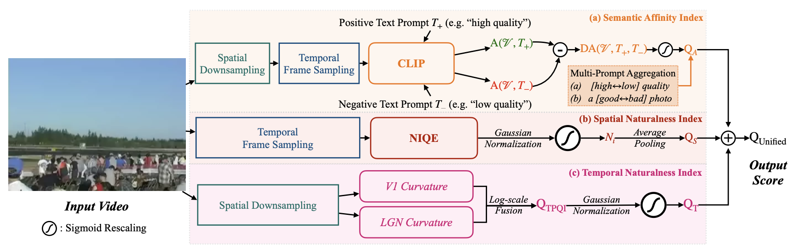

# BVI-Pytorch (Zero-shot Blind Video Quality Index)

*Pytorch-accelerated Codebase.* 
The Official Repository for BUONA-VISTA, a robust zero-shot Video Quality Index.


## Introduction

In this work, we introduce an explicit semantic affinity index for opinion-unaware Video Quality Assessment (a.k.a. Zero-shot VQA) using text-prompts in the contrastive language-image pre-training (CLIP) model. We also aggregate it with different traditional low-level naturalness indexes through gaussian normalization and sigmoid rescaling strategies. Composed of aggregated semantic and technical metrics, the proposed Blind Unified Opinion-Unaware Video Quality Index via Semantic and Technical Metric Aggregation (BUONA-VISTA) outperforms existing opinion-unaware VQA methods significantly by **at least 20% improvements**, and is more robust than opinion-aware approaches. Extensive studies have validated the effectiveness of each part of the proposed BUONA-VISTA quality index.



## To-Do

- [x] ~~Pytorch Code for Temporal Naturalness Index ([TPQI](https://github.com/UOLMM/TPQI-VQA))~~
- [x] ~~Pytorch Code for Spatial Naturalness Index (re-aligned NIQE)~~
- [x] ~~Pytorch Code for Semantic Affinity Index (CLIP-based)~~

## Usage

Extract Semantic Affinity Index:

```
python semantic_affinity.py
```

Extract Spatial Naturalness Index:

```
python spatial_naturalness.py
```

Extract Temporal Naturalness Index:

```
python temporal_naturalness.py
```


Evaluate the Aggregated Results

See *combine.ipynb*

## Note: Possible Performance Drop

The Code for Temporal Naturalness Index is slightly different from the original version (with only V1 curvature), therefore we might experience some performance drop. We will try to include the code for LGN curvature computation in the following versions.

Here shows performance of the Codebase (Performance of Original Paper with MatLab Code):

|       | KoNViD-1k | CVD2014 | LIVE-VQC | 
| ----  |    ----   |   ---- |  ----   |   
| SROCC | 0.758 (0.760 in paper) | 0.683 (0.740 in paper) | 0.744 (0.784 in paper) | 
| PLCC  | 0.755 (0.760 in paper) | 0.708 (0.763 in paper) | 0.765 (0.794 in paper) |

*The acceleration is around 10x compared with original version.*
